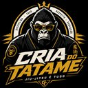

# 🦍🥋 Cria do Tatame – Pressão

Jogo de luta 2D e Action RPG de carreira sobre **Jiu-Jitsu Brasileiro posicional**, ambientado no Baixo Sul da Bahia e construído em Godot.

> **Ser forte é ser gentil.**  
> De cria pra cria. Luta. Disciplina. Evolução.

## Logo oficial

<p align="center">
  
</p>

A fonte visual aprovada pelo criador está em [`assets/branding/logo_oficial_cria_do_tatame.svg`](assets/branding/logo_oficial_cria_do_tatame.svg). Seu contrato canônico, hashes, regras de uso e derivados obrigatórios estão em [`data/visual/brand_identity_v01.json`](data/visual/brand_identity_v01.json).

> **Atenção jurídica:** a imagem-fonte contém um wordmark de terceiro observado nos óculos. Ela é a referência visual oficial, mas não está liberada para publicação comercial até a limpeza registrada no contrato visual.

## Estado do projeto

| Camada | Estado |
|---|---|
| Runtime central | Implementado e auditado em `main` |
| Menu → Terreiro → combate → resultado → save | Coberto por smoke tests |
| Combate posicional, deck e IA de Davi | Implementados na base atual |
| Export Android ARM64 e Windows | Pipeline disponível; Android físico continua gate obrigatório |
| Cânone e combate v4 | Produzidos parcialmente em PRs; ainda exigem integração controlada |
| Arte, animação e áudio finais | Em produção; concept art e candidatos não contam como shipping |
| Jogo completo | Não concluído |

O repositório separa explicitamente seis estados: **especificado, implementado, integrado, validado automaticamente, testado por humano/aparelho e pronto para release**.

## Fonte única de verdade

```text
https://github.com/ringuemkt-rgb/cria-do-tatame
```

Este é o único repositório oficial do jogo. Código, dados, lore, arte, áudio, ferramentas, builds e planejamento devem convergir aqui. Protótipos vivem em branches; não em repositórios concorrentes.

## Identidade canônica

- **Protagonista:** Ruan “Macacão” Silva;
- **Origem:** Ituberá, Baixo Sul da Bahia;
- **Símbolo:** Gorila Silverback;
- **Estilo:** pressão, grip de ferro e top game dominante;
- **Poder:** Silverback Grip;
- **Logo oficial:** Silverback coroado, kimono preto, emblema circular e wordmark `CRIA DO TATAME`;
- **Facções ativas do cânone v4:** LEM, NTM e ALE;
- **Visual:** Pixel Art 16-bit 2.5D Regional Premium;
- **Plataformas-alvo:** Android ARM64 e Windows x86_64;
- **Engine:** Godot 4.3+; compatibilidade mínima atualmente auditada em 4.2.2.

Referências antigas a Caio Ravel ou Ruan “Cria” são legado e não entram em shipping. `Cria do Tatame` é o título da marca; o protagonista permanece Ruan “Macacão” Silva.

## Fluxo jogável obrigatório

```text
Main Menu
→ Terreiro da Luta
→ treino/deck
→ combate
→ resultado
→ Cria Live
→ avanço da semana
→ save
→ retorno ao Terreiro
```

A prioridade é manter esse fluxo funcionando antes de expandir o mundo.

## Estrutura do repositório

```text
.
├── .github/             # CI, templates e CODEOWNERS
├── .agents/             # skills e instruções operacionais
├── assets/              # assets aprovados e candidatos claramente separados
├── data/                # dados, schemas e contratos executáveis
├── docs/                # cânone, arquitetura, produção e QA
├── scenes/              # cenas Godot
├── src/                 # runtime Godot
├── tests/               # smokes e regressões
├── tools/               # auditoria, build e produção offline
├── production/          # lotes e controle de produção
├── reports/             # evidências e relatórios versionáveis
├── project.godot
├── export_presets.cfg
├── AGENTS.md
├── CONTRIBUTING.md
└── README.md
```

Não crie uma segunda árvore de jogo, outro `project.godot`, outro runtime ou frontend concorrente.

## Começando

### Pré-requisitos

- Godot 4.3+;
- Node.js 20+;
- Python 3.10+;
- JDK 17 e Android SDK para exportação Android.

### Clone

```bash
git clone https://github.com/ringuemkt-rgb/cria-do-tatame.git
cd cria-do-tatame
```

### Validação completa

```bash
npm run quality
```

O quality gate verifica governança, cânone, facções, identidade visual, ART_PROTOCOL, tokens, JSON, referências de dados, animações, estrutura, runtime, release readiness, contrato supremo e deck.

Validar somente o protocolo visual:

```bash
npm run validate:art-protocol
python -m pytest -q tests/test_art_protocol.py
```

### Godot headless

```bash
godot --headless --editor --path . --quit
godot --headless --path . --script res://tests/runtime_smoke.gd
```

### Abrir no editor

Abra `project.godot` e execute a cena principal configurada:

```text
res://scenes/main_menu/MainMenu.tscn
```

## Builds

### Android no Windows

```powershell
powershell -ExecutionPolicy Bypass -File .\tools\build\check_environment.ps1
powershell -ExecutionPolicy Bypass -File .\tools\build\build_android_debug.ps1
```

Exportar e instalar em aparelho conectado:

```powershell
powershell -ExecutionPolicy Bypass -File .\tools\build\build_android_debug.ps1 -Install
```

### Android no Linux

```bash
bash tools/build/build_android_debug.sh
```

### Windows

```powershell
powershell -ExecutionPolicy Bypass -File .\tools\build\build_windows_debug.ps1
```

Um APK não é considerado pronto apenas porque foi exportado. O gate exige instalação, toque, fluxo completo, save após reinício e medições em aparelho físico.

## Produção visual e audiovisual

Fonte única de verdade da execução visual:

```text
docs/ART_PROTOCOL.md
data/art_tokens.json
```

O protocolo fixa paleta, tipografia, proporção 60/30/10, iconografia, grid, quatro barras de combate, pixel art, motion, orçamento mobile e proibições. Qualquer mudança nesses elementos exige bump SemVer e changelog. Mockup, prompt ou concept art não substituem o protocolo.

Inventário canônico:

```text
data/visual/production_manifest_v02.json
```

Gerar fila de produção:

```bash
npm run assets:queue
```

Cada asset final precisa de origem/licença, metadata, preview, QA e integração em uma cena real. Técnicas de Jiu-Jitsu são animações pareadas: atacante e defensor compartilham pivôs, timing e `sync_map`.

Concept art, mockup, prompt, spritesheet bruto ou fila JSONL não são assets finais.

## Documentação essencial

- [`docs/INDEX.md`](docs/INDEX.md) — índice canônico;
- [`docs/ART_PROTOCOL.md`](docs/ART_PROTOCOL.md) — protocolo visual permanente e checklist `/ARTE-CHECK`;
- [`data/art_tokens.json`](data/art_tokens.json) — tokens visuais machine-readable;
- [`docs/REPOSITORY_GOVERNANCE.md`](docs/REPOSITORY_GOVERNANCE.md) — branches, PRs e fonte única;
- [`docs/ROADMAP.md`](docs/ROADMAP.md) — sequência oficial de construção;
- [`AGENTS.md`](AGENTS.md) — regras para agentes;
- [`CONTRIBUTING.md`](CONTRIBUTING.md) — fluxo de colaboração;
- [`docs/CRIA_DO_TATAME_SUPREME_BUILD_SPEC_V1.md`](docs/CRIA_DO_TATAME_SUPREME_BUILD_SPEC_V1.md) — escopo completo;
- [`data/visual/brand_identity_v01.json`](data/visual/brand_identity_v01.json) — identidade visual e logo oficial;
- [`data/visual/visual_canon_contract_v2.json`](data/visual/visual_canon_contract_v2.json) — contrato visual geral;
- [`data/production/supreme_build_contract_v01.json`](data/production/supreme_build_contract_v01.json) — metas e release gates;
- [`docs/qa/RUNTIME_AUDIT_V08.md`](docs/qa/RUNTIME_AUDIT_V08.md) — auditoria do runtime;
- [`docs/production/APK_VISUAL_COMPLETION_PLAN_V09.md`](docs/production/APK_VISUAL_COMPLETION_PLAN_V09.md) — Definition of Done Android e audiovisual.

## Contribuição

1. Leia `CONTRIBUTING.md`;
2. abra uma issue usando o formulário adequado;
3. trabalhe em branch com prefixo aprovado;
4. entregue um lote pequeno e integrado;
5. execute `npm run quality`;
6. abra PR com testes, riscos e rollback.

A `main` deve permanecer bootável. Novos managers, engines ou sistemas concorrentes são proibidos sem plano de migração e adapter aprovado.

## Segurança e licenças

Não versione tokens, `.env`, keystore, senha, dados pessoais, modelos gigantes ou assets sem licença. Consulte [`SECURITY.md`](SECURITY.md).

Gameplay crítico funciona offline. Serviços externos e IA são opcionais e não controlam o combate em tempo real.

Marcas, brasões, academias, ligas, eventos e patrocinadores reais não entram em shipping sem autorização escrita ou substituição ficcional.

## Próximo objetivo

Consolidar o runtime v4 em lotes seguros e fechar o **vertical slice ouro Ruan × Davi**: Terreiro, deck, Arena do Dique, combate completo, Cria Live, save/reload, touch, áudio e arte representativa rodando em Android físico com desempenho aprovado.
